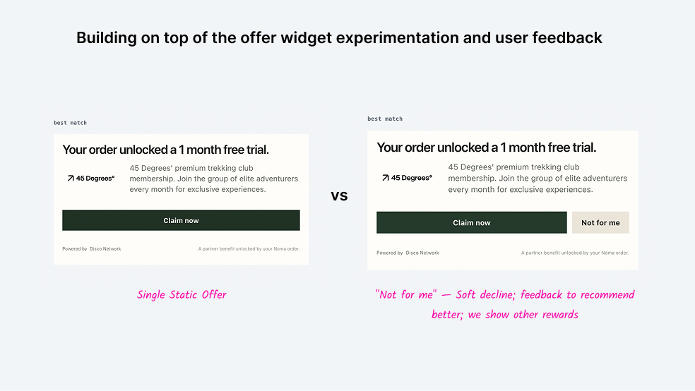
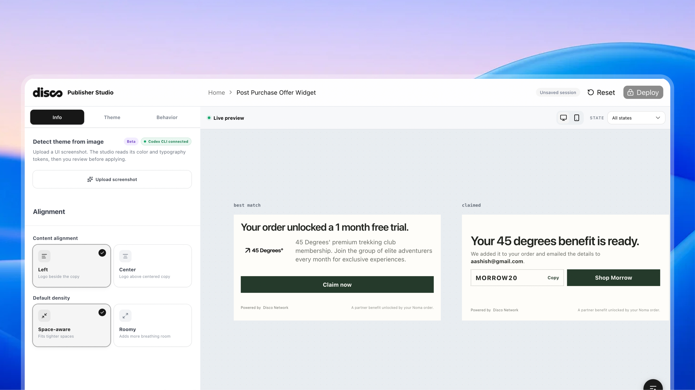
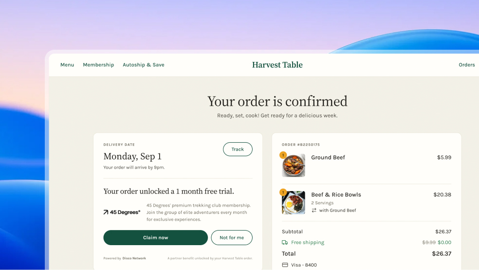
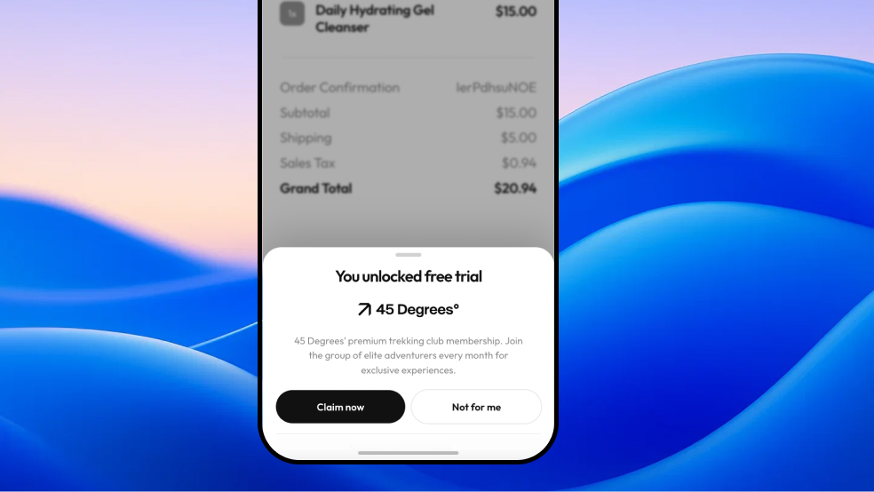
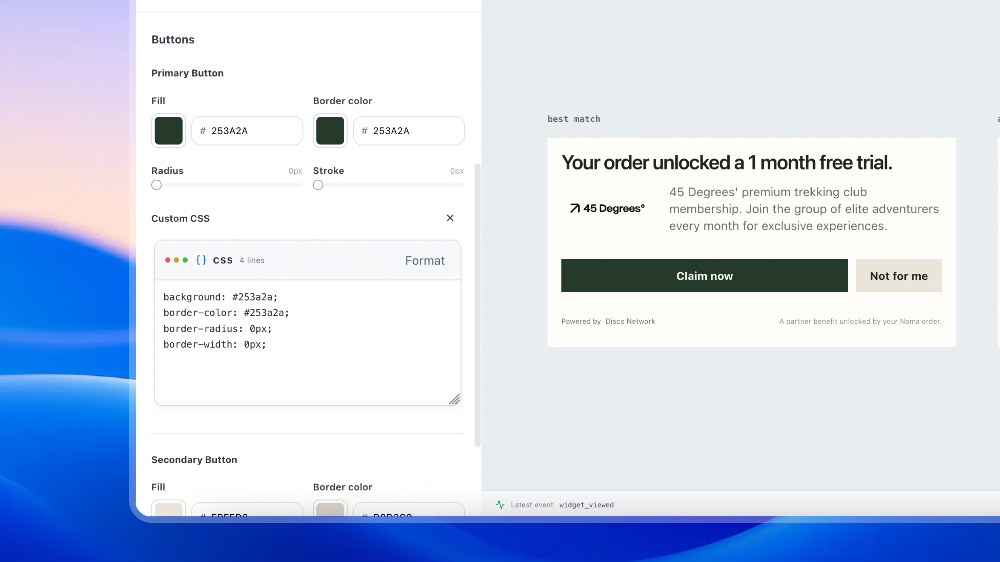
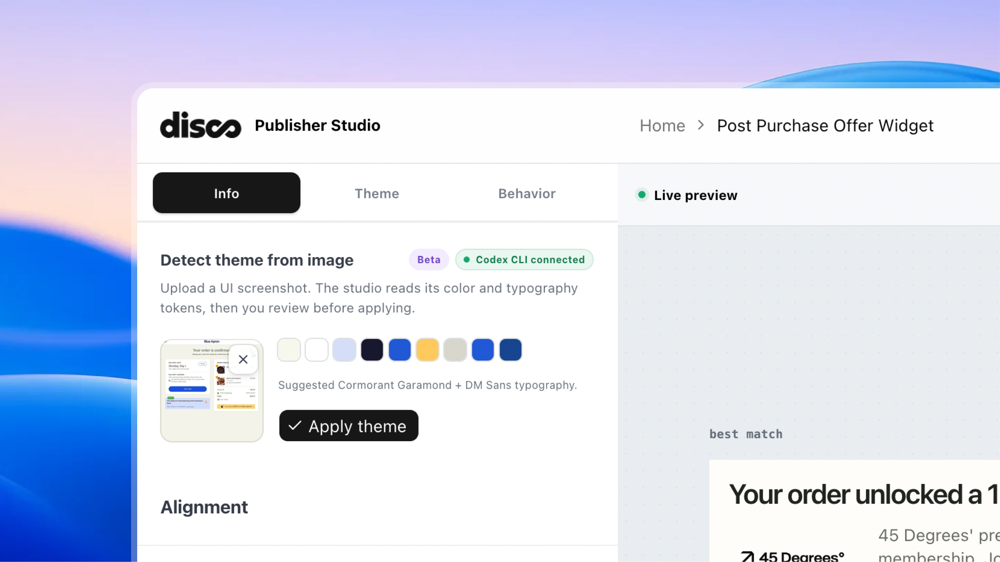

# Disco Offer Studio

This prototype explores post-purchase offer experiences for Disco: through designing experiments around the offer widget and building a highly cutomisable yet user friendly publishing system.

The goal is not to recreate Disco's ranking or attribution systems. It is to make the interaction and the publisher controls concrete enough to test.

## Run locally

Requires Node.js `>=22.13.0`.

```bash
npm install
npm run dev
```

Open [http://localhost:3000](http://localhost:3000).

Routes:

- `/` — publisher configuration studio and live widget preview
- `/demo/1` — widget embedded in a desktop order-confirmation page
- `/demo/2` — widget embedded as a mobile post-purchase sheet

Run the production build and rendered-state checks with:

```bash
npm test
```


## What I built and why


### 1. Shopper-facing offer widget

The default experience starts with one static, best-match offer. Building on top of it we introduct an action "Not for me"

- **Claim** — accepts the recommendation.
- **Not for me** — Recovery interaction; records a rejection and reveals two alternatives at the same time.

The recovery interaction is the core product hypothesis. A carousel makes shoppers swipe through hidden choices and can turn a bad first match into silent abandonment. “Not for me” creates a low-cost signal, and two simultaneous alternatives let the shopper self-select without another swipe. The flow has one rejection round and a clear terminal exit so it does not become an endless recommendation loop.

The widget also includes claimed, error, empty, and dismissed states. It can show coupon copy and a partner destination, and it has responsive desktop and mobile treatments.

### 2. Publisher-facing Offer Studio

The Studio is built to ensure and inspire a publisher to design the widget such that it doesn't look like a Ad. It should feel like a native component well placed in a customers ecommerce journey.

 A publisher can preview, configure alignment, density, typography, colors, container and button styling, custom button CSS, offer behavior, viewport, and widget state. 
 
 It also includes a screenshot-to-theme flow that proposes design tokens for review before applying them.

The product bet is that relevance is only half the experience. The offer must also feel credible and native to the confirmation page. Publisher-controlled styling makes that presentation reusable across placements without turning every integration into a bespoke design project.

## Visual walkthrough

### The experiment

The control is a single static offer. The treatment adds “Not for me” as a soft decline and uses the response to surface better alternatives.



### Publisher Studio

The Studio brings the configuration surface and stateful preview into one workspace. Publishers can move between the default and claimed states while tuning the presentation.



### Embedded post-purchase contexts

The same widget is tested in two host environments: a desktop confirmation page and a mobile order sheet.

<table>
  <tr>
    <td></td>
    <td></td>
  </tr>
  <tr>
    <td align="center">Desktop confirmation page</td>
    <td align="center">Mobile post-purchase sheet</td>
  </tr>
</table>

### Publisher control and AI-assisted theming

> Note: The AI-assisted theming feature is not available on the deployed link.

Custom CSS stays available for the last mile of brand control. Screenshot analysis suggests a palette and typography tokens, but the publisher reviews them before applying anything.

<table>
  <tr>
    <td></td>
    <td></td>
  </tr>
  <tr>
    <td align="center">Custom CSS controls</td>
    <td align="center">Screenshot-to-theme suggestions</td>
  </tr>
</table>

## Signals behind the decisions

The decisions below come from the take-home assignment brief and the companion `design-rationale.md` and `metrics-framework.md` documents.


| Signal                                                                                                                                                                                                                     | Design decision                                                                                                                                     |
| -------------------------------------------------------------------------------------------------------------------------------------------------------------------------------------------------------------------------- | --------------------------------------------------------------------------------------------------------------------------------------------------- |
| The brief's A/B test showed **3-offer carousel: 2.9% CTR, 12% claim rate, $8.40 Rev/1K** versus **1-offer static: 3.6% CTR, 17% claim rate, $11.80 Rev/1K**.                                                               | Make one offer the default. It won on every reported metric, so alternatives should not compete with it before the shopper asks for another option. |
| A shopper said, **“The first offer is rarely what I want, so I ignore the whole thing.”**                                                                                                                                  | Add “Not for me” so rejection becomes explicit engagement and a useful future matching signal instead of an invisible scroll-past.                  |
| **72% of traffic is mobile**. Mobile performance is reported as **2.6% CTR / 10% claim**, versus **3.8% CTR / 16% claim** on desktop.                                                                                      | We designed different layouts for devices and stylistic approaches to make sure it looks native device and brand             |
| Position value dropped from **$18.20 to $4.60 to $1.10** as carousel position and swipe friction increased. The rationale correctly treats this as horizontal-reveal data, not proof that vertical scrolling always fails. | Avoid hidden or swipe-to-reveal alternatives. Recovery options appear simultaneously, with vertical stacking as the more discoverable fallback.     |
| Shoppers said, **“I didn't realize I could swipe”** and **“I'd use it if it felt personalized to what I just bought.”**                                                                                                    | Remove the hidden-carousel interaction and treat purchase-anchored copy as a future relevance signal, not something generic ad copy can replace.    |
| The widget appears immediately after checkout, when the shopper is still confirming the order.                                                                                                                             | Inspire publishers to customise and integrate to as close as native with ease, receipt-like hierarchy: merchant styling, clear value, explicit expiry, honest disclosure, and a dignified exit.                       |
| Rejection changes the model's confidence: its first guess was wrong.                                                                                                                                                       | Test two candidates after rejection as a deliberate hedge. This is not the same choice architecture as showing three competing offers up front.     |


The preview also exposes the basic production event vocabulary: `widget_viewed`, `offer_claimed`, `offer_rejected:primary`, `alternatives_viewed`, `alternatives_rejected`, and `code_copied`.

## What I chose not to build

- **Adding timers, badges and tags.** The Studio is session-only. Saving, publishing, permissions, approvals, version history, and real merchant integrations need Disco's account and platform model.
- **Offer ranking and personalization.** The prototype assumes inventing a ranking model or synthetic customer graph would make the demo look more complete without producing useful evidence.
- **Purchase-anchored copy and rejection-reason chips.** “Because you ordered X…” is a strong future hypothesis. Reason chips such as “Not my style” or “Already have this” were left out because they add friction at the moment of disengagement.
- **Ratings, social proof, video, and browsing.** These are separate trust and discovery experiments. Adding them now would make the first recovery test harder to interpret.
- **Autonomous AI styling.** Theme extraction suggests a constrained token set and waits for publisher approval; it does not generate arbitrary CSS or publish changes.


## What I would measure after launch

I would run this against the existing carousel with a persistent holdout. The hierarchy matters: one north-star metric, diagnostics that explain movement, and guardrails that catch damage the top line hides.

### North star: Revenue per 1,000 impressions (Rev/1K)

The launch benchmark is **$11.80**, the known single-offer baseline. The recovery flow should add value on top of that, not simply beat the weaker `$8.40` carousel baseline. CTR is a diagnostic, not the goal; deceptive visuals can raise clicks while damaging trust and merchant value.

### Funnel

`Impression → Viewed → Engaged → Claimed → Redeemed`

- **Impression:** the widget was served; denominator for Rev/1K.
- **Viewed:** the widget rendered in the viewport; separates unseen from seen-and-ignored.
- **Engaged:** any tap, including “Not for me.”
- **Claimed:** the primary or recovery offer was claimed.
- **Redeemed:** the claim led to an actual merchant transaction. This is the important data gap the brief leaves open.


### Recovery diagnostics

- **Rejection rate vs. ignore rate:** a rejection is engagement. A shift from silent ignore to explicit rejection may be positive even if raw rejection rises.
- **Recovery rate:** alternative claims divided by users who rejected the primary. High rejection plus high recovery suggests ranking quality is the issue; high rejection plus low recovery suggests thin offer supply.
- **Recovery choice split:** if roughly **85% or more** of recovery claims come from the top card, position bias dominates and one alternative may be enough. A more even split supports the two-candidate hedge.


### Trust and operational guardrails

- Repeat engagement on a subsequent purchase.
- Time-to-first-interaction, as a proxy for whether the unit is being read as part of the page rather than filtered as an ad.
- Merchant confirmation-page health and order-status engagement.
- p95 widget render latency.
- Abandonment during a future loading state.


### Planned experiments

1. **One versus two recovery alternatives** — does post-rejection hedging outperform a single second guess?
2. **0ms versus roughly 600ms loading feedback** — does perceived effort increase recovery claims or cause abandonment?

The experiment is working when Rev/1K beats **$11.80**, downstream redemption and repeat engagement improve, and page health, latency, and merchant trust remain within guardrails. A claim-rate increase on its own is not a win.

## AI tools and skills used


### Tools

1. **Codex** — coding the React prototype, shaping the component architecture, implementing interaction states, and writing regression checks.
2. **ChatGPT** — researching Disco's public context, synthesizing evidence, and brainstorming product hypotheses and measurement plans.
3. **Paper Design** — wireframing and exploring the publisher configuration studio and shopper-facing offer flow.


### Skills and workflows

1. **Interface design skills** — translating the hypothesis into hierarchy, responsive behavior, states, copy, and reusable controls.
2. **Analytics skill** — defining the event taxonomy, funnel, incrementality approach, and trust guardrails.
3. **Ponytail code optimisation** — tightening the implementation while preserving the prototype's state coverage.
4. **Repo architecture skill** — separating the configurator, widget renderer, demo routes, theme extraction, and shared configuration model.
5. **React Doctor** — checking the React implementation for avoidable rendering and maintainability issues.

The screenshot-to-theme feature is also AI-assisted, but publisher approval is required before any suggested tokens are applied. No customer data, internal Disco data, ranking model, or production integration was used.
